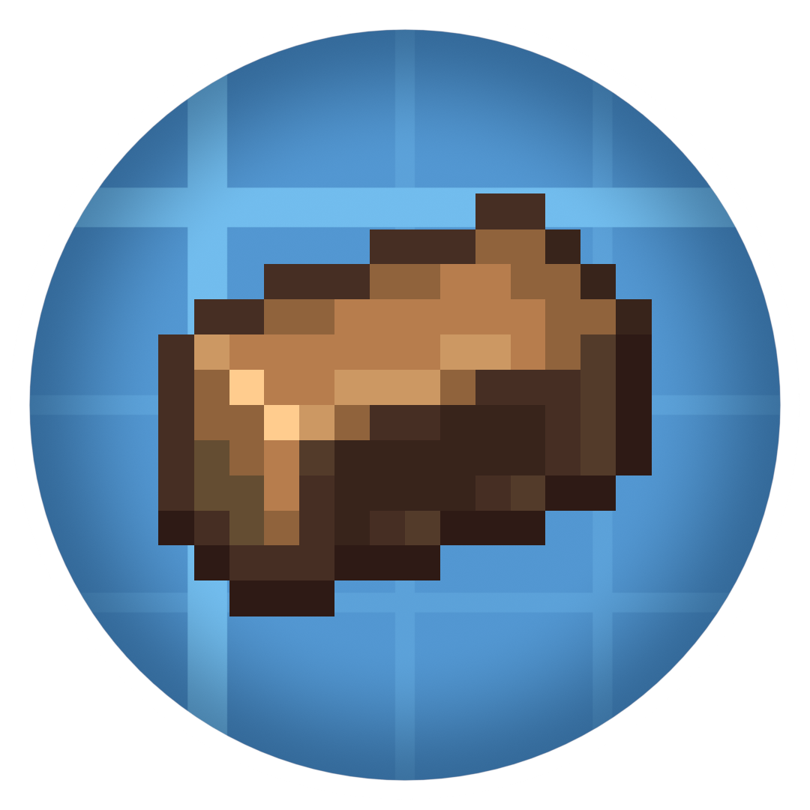

# Create Brassite

This project is just me learning how to mod! ~~(aka I have no idea what I am doing)~~

It will (hopfully) be an addon for the Create mod.

## Credits

Some assets were used or modified from other creators:

- Textures from [Create](https://github.com/Creators-of-Create/Create/tree/mc1.20.1/dev?tab=readme-ov-file) by simibubi, licensed under the MIT License.
